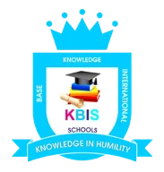
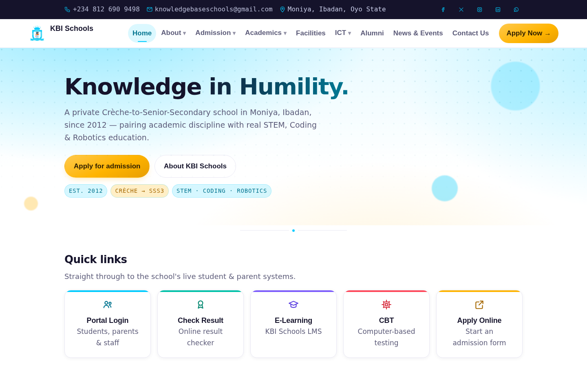

<div align="center">



# Knowledge Base International Schools

**Knowledge in Humility** — Crèche to Senior Secondary education in Moniya, Ibadan.

[](https://github.com/kbischool/kbischool.github.io/actions/workflows/deploy.yml)
[](https://github.com/kbischool/kbischool.github.io/actions/workflows/codeql.yml)

[Live site](https://kbischool.github.io/) · [Documentation](docs/) · [Report an issue](https://github.com/kbischool/kbischool.github.io/issues)

</div>



## About

The public website of Knowledge Base International Schools (KBI), a private school founded in 2012 and affiliated with NAPPS, serving pupils from Crèche through SSS3. It gives parents and prospective families the school's story, sections, facilities, STEM and coding programme, news, and a direct route to admission and the school's student portals.

## Features

- Pages for About, Admission, Academics, Facilities, ICT, Alumni, News & Events and Contact
- Quick links to the school's portal login, result checker, e-learning, CBT and online application
- Admission and contact enquiry forms that deliver to the school's email
- Light and dark themes that follow the device setting and remember the visitor's choice
- Responsive layout from small phones to wide screens, keyboard-friendly navigation and reduced-motion support

## How to use it

Browse the site at [kbischool.github.io](https://kbischool.github.io/). Use **Apply Now** to start an admission, or the **Contact Us** page to send a message to the school.

## Tech stack

Static HTML, CSS and JavaScript with no framework. Fonts (Sora, Inter, JetBrains Mono) are served by Google Fonts. Hosted on GitHub Pages and deployed with GitHub Actions. Enquiry forms use [FormSubmit](https://formsubmit.co/).

## Project structure

```
index.html … contact.html   Site pages
404.html                    Not-found page
assets/style.css            Base design system
assets/premium.css          Design tokens, dark theme, motion
assets/script.js            Navigation, theme toggle, reveals
assets/img/                 Logo, favicons, social preview
docs/                       Owner and maintainer guides
.github/workflows/          Deployment and code scanning
```

## Contributing

Spotted a mistake or have an idea? [Open an issue](https://github.com/kbischool/kbischool.github.io/issues/new) on GitHub, or edit a file in the browser and propose the change as a pull request.

## Credits

Crest and school content belong to Knowledge Base International Schools. Fonts are open-source under the SIL Open Font License via Google Fonts.

Built by [Babatunde Awoyemi](https://github.com/babatundeawo) / Techbase Consultant Services.
